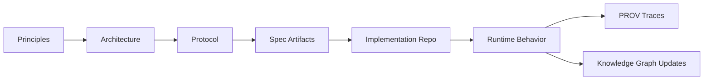

# Project Overview (Foundations)

This repo is the canonical contract for Agent Context Graph (ACG). It defines the principles and machine-readable specs that implementations must obey. It is written for principal engineers and engineering managers who need a clear boundary of truth, governance, and change control.

## Executive summary

ACG formalizes how agents discover and execute affordances via ephemeral Context Graphs and how they consult persistent Knowledge Graphs for long-term memory. A virtual semantic layer exposes federated data through HyprCat-aligned Hydra catalogs and SHACL-based contracts. The contract is expressed in JSON Schema, SHACL, OWL ontology, and protocol docs. The aim is to make agent behavior auditable, composable, and policy-bounded. Hypergraph semantics model multi-party actions; category-theoretic composition formalizes workflow composition; usage-based semiotics captures meaning from observed usage; tool authoring is explicit and policy-gated.

## Why a separate foundations repo

- Contract stability and governance independent of runtime code.
- Clear API and data contracts for multiple implementations.
- Easier change review, versioning, and deprecation management.
- Shared specs for tooling, validation, and audits.

## Core mental model

- A Context Graph is the runtime contract exposed to agents.
- A Knowledge Graph is persistent, ontology-aligned memory referenced by contexts.
- Affordances are hyperedges binding agents, targets, credentials, and constraints.
- Traversals emit PROV traces for accountability and reproducibility.
- Usage semantics are derived from observed usage and shape future affordances.
- Tools are created and discovered via affordances, not global lists.

## What lives here

- principles/     Conceptual invariants and safety rules.
- architecture/   System boundaries and component responsibilities.
- protocol/       API-level semantics and payload shapes.
- spec/           JSON Schema, SHACL shapes, Hydra docs, and OWL ontologies.

## How the pieces fit (mermaid)

## Change management expectations

- Prefer additive changes to schema and ontology.
- Breaking changes should be versioned and documented with migration notes.
- Protocol changes must keep backward compatibility where possible.
- All changes should include updated examples and validation fixtures.

## Key entry points (Foundations)

- principles/README.md
- architecture/ARCHITECTURE_INDEX.md
- protocol/API.md
- spec/context-graph.schema.json
- spec/prov-trace.schema.json
- spec/ontology/acg-core.ttl
- spec/shacl/context.ttl
- spec/HYPERGRAPH.md
- spec/CATEGORY-THEORY.md
- spec/telemetry.md
- spec/causal-affordance.md
- spec/cgp.md

## How implementation consumes this repo

The implementation repo loads specs from this repo. If both repos are cloned side by side, no extra configuration is needed. Otherwise, set ACG_SPEC_DIR to point at this repo's spec directory.

## Repos

- Foundations: https://github.com/markjspivey-xwisee/agent-context-graph-foundations
- Implementation: https://github.com/markjspivey-xwisee/agent-context-graph-implementation
